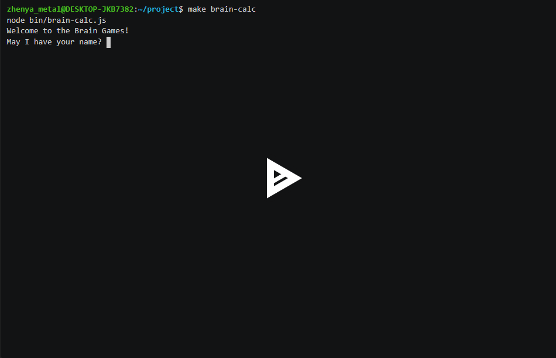
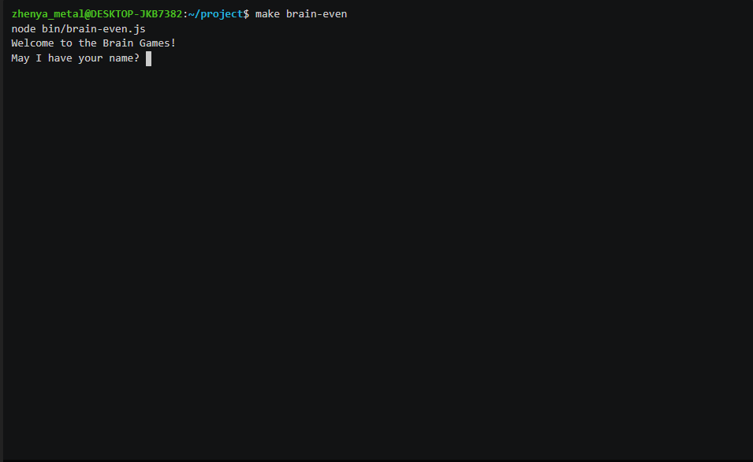
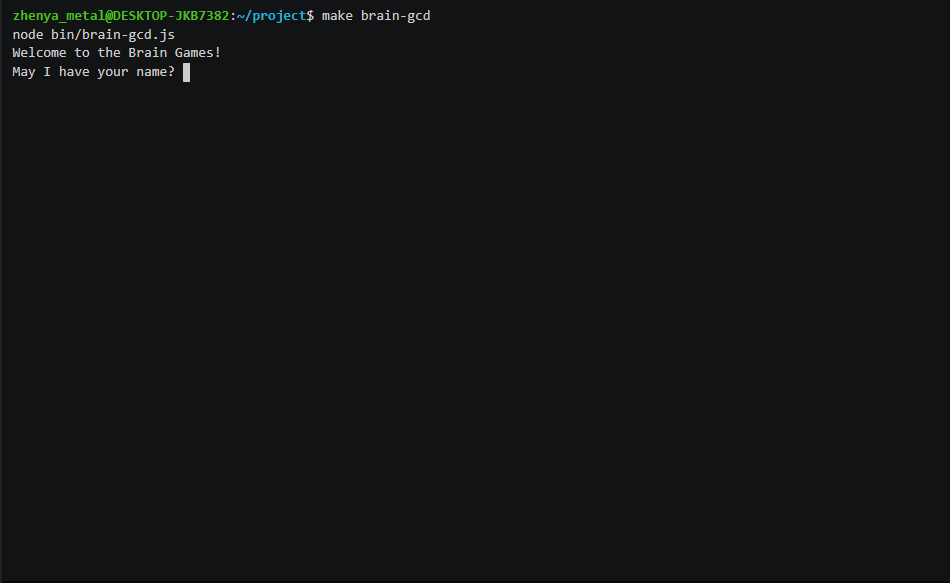
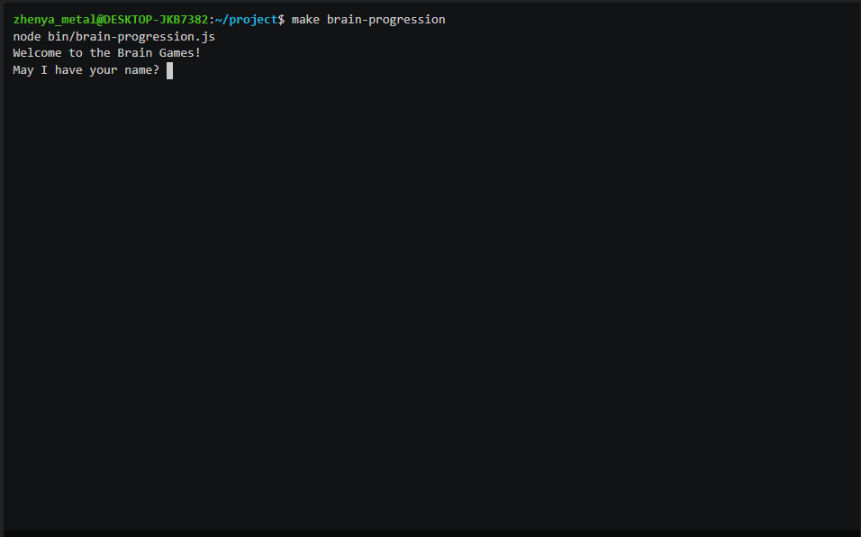
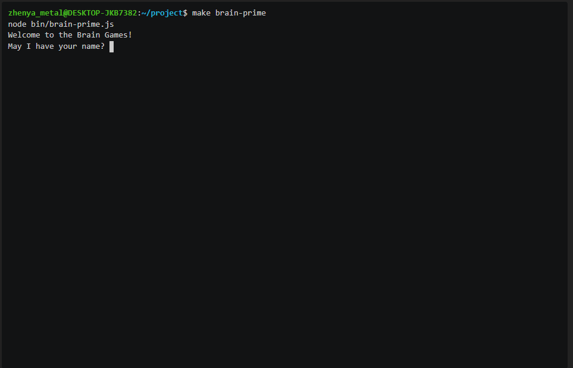

### Hexlet tests and linter status:

Ссылка на аскисинему игры "Калькулятор":
https://asciinema.org/a/M7KBHbARs4TWabHBkTAZRpQNZ

Ссылка на аскисинему игры "Проверка на четность":
https://asciinema.org/a/7Rn5GgtQmUQKurDZq76jJvtj1

Ссылка на аскисинему игры "НОД":
https://asciinema.org/a/AjqgCRze8c11dtoZ7GDUq6Gpp

Ссылка на аскисинему игры "Арифметическая прогрессия":
https://asciinema.org/a/ZIefEQSSB5jUnb09gYOVZvw3X

Ссылка на аскисинему игры "Простое ли число?":
https://asciinema.org/a/yxM5fP7vIud9OIRgfLkTnMMu4
